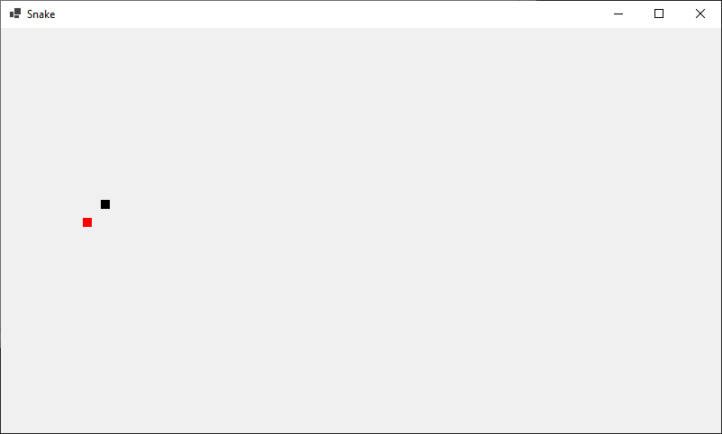

# Змейка (Snake Game)

Простая реализация классической игры "Змейка" на C# с использованием Windows Forms.

## Описание

Этот проект представляет собой базовую версию игры "Змейка", где игрок управляет движением змейки для сбора еды. Каждый раз, когда змейка съедает еду, она увеличивается в размере. Игра заканчивается, если змейка сталкивается с границами поля или с собственным телом.

## Особенности

- Простое управление с помощью клавиш со стрелками.
- Счетчик набранных очков.
- Возможность перезапуска игры после проигрыша.

## Технологии

- C#
- .NET Framework
- Windows Forms

## Установка и Запуск

Для запуска игры необходимо:

1. Клонировать репозиторий:
   ```bash
   git clone https://github.com/fuccpuff/LearningSnakeGame.git

Скриншоты


Как играть
- Используйте клавиши со стрелками для управления змейкой.
- Собирайте красные точки (еду) для увеличения размера змейки.
- Избегайте столкновений с границами поля и с собственным телом
